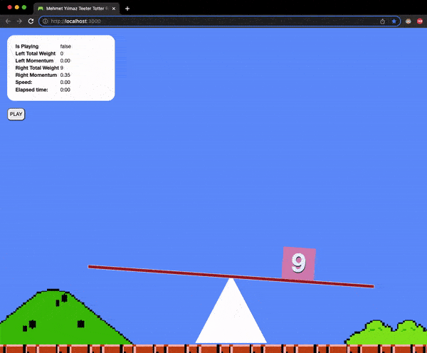

# Insider Coding Challenge Project

This is a ReactJS challenge project called teeter tootter for Insider job apply.

## Live demo: [https://61cee898add95e3d6d46c320--modest-swirles-c8d3ff.netlify.app/](https://61cee898add95e3d6d46c320--modest-swirles-c8d3ff.netlify.app/)

## Preview

### Algorithm

#### For the right side
- Initialy created weight object(s) are placed into the arm container.
- Arm bends depending on the factor value which calculated by the ratio of the weigts position to arm half width. (posx - (armWidth / 2)) / (armWidth / 2)
- When a flying object reaches the left side an right object is created and placed to the right side.

#### For the left side
- When the user clics the play button a flying is created
- After creation a interval timer starts and increases the y position of object
- At the same time user can move the object to righ and left with the keys arrow left and arrow right
- when flying object reaches the arm it is added to the left side objects list and flying object is cleared for new one

When movement is going ahead on if bending exceeds limit of %30 the game is stopped.

## Available Scripts

In the project directory, you can run:

### `yarn start`

Runs the app in the development mode.\
Open [http://localhost:3000](http://localhost:3000) to view it in the browser.

The page will reload if you make edits.\
You will also see any lint errors in the console.

### `yarn test`

Launches the test runner in the interactive watch mode.\
See the section about [running tests](https://facebook.github.io/create-react-app/docs/running-tests) for more information.

### `yarn build`

Builds the app for production to the `build` folder.\
It correctly bundles React in production mode and optimizes the build for the best performance.

The build is minified and the filenames include the hashes.\
Your app is ready to be deployed!

See the section about [deployment](https://facebook.github.io/create-react-app/docs/deployment) for more information.

### `yarn eject`

**Note: this is a one-way operation. Once you `eject`, you can’t go back!**

If you aren’t satisfied with the build tool and configuration choices, you can `eject` at any time. This command will remove the single build dependency from your project.

Instead, it will copy all the configuration files and the transitive dependencies (webpack, Babel, ESLint, etc) right into your project so you have full control over them. All of the commands except `eject` will still work, but they will point to the copied scripts so you can tweak them. At this point you’re on your own.

You don’t have to ever use `eject`. The curated feature set is suitable for small and middle deployments, and you shouldn’t feel obligated to use this feature. However we understand that this tool wouldn’t be useful if you couldn’t customize it when you are ready for it.

